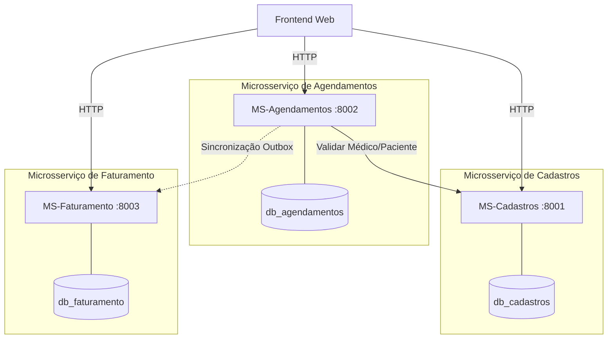

# Clínica Multi-Especialidades | Arquitetura de Microsserviços

Projeto desenvolvido para a disciplina de **Arquitetura e Padrões de Software** no **CEFET/RJ**. O sistema é uma demonstração prática de uma arquitetura baseada em microsserviços tolerante a falhas (resiliência com *Outbox Pattern*) e com banco de dados isolado (*Database per Service*).

---

## 🏗️ Arquitetura do Sistema

O sistema é construído no padrão monorepo estruturado da seguinte forma:

```
/sistema-clinicas
├── /db-init                  # Scripts SQL de inicialização do PostgreSQL
├── /docs                     # Documentação arquitetural e PDF do trabalho
├── /frontend                 # Painel Web Cliente (HTML5, CSS3, JavaScript)
├── /ms-cadastros             # Microsserviço de CRUD de Pessoas (FastAPI + SQLAlchemy)
├── /ms-agendamentos          # Microsserviço de Agendamento (FastAPI + SQLAlchemy)
├── /ms-faturamento           # Microsserviço Financeiro e de Faturamento (FastAPI + SQLAlchemy)
├── docker-compose.yml        # Orquestração local de serviços e banco de dados
├── seed_db.py                # Script de limpeza e população rápida de demonstração
└── test_integration.py       # Suíte de testes de integração automatizados
```

### 🛰️ Integração e Fluxo de Resiliência



---

## ⚡ Como Rodar o Projeto (Quick Start)

### 1. Pré-requisitos
* Ter o **Docker** e **Docker Compose** instalados na máquina.
* Ter o **Python 3.x** instalado localmente (para executar scripts de testes e população).

### 2. Iniciar os Microsserviços (Docker)
Suba os containers da aplicação no diretório raiz:
```powershell
docker compose up --build -d
```
Isso iniciará o banco de dados PostgreSQL físico (`clinica_db`) com 3 bases lógicas separadas e os 3 microsserviços nas seguintes portas locais:
* **MS-Cadastros:** `http://localhost:8001`
* **MS-Agendamentos:** `http://localhost:8002`
* **MS-Faturamento:** `http://localhost:8003`

### 3. Limpar e Popular o Banco de Dados (Seed)
Para gerar médicos com escalas, especialidades, pacientes e consultas de teste em diferentes estados, execute o script no terminal:
```powershell
python seed_db.py
```

### 4. Acessar a Interface Gráfica (Frontend)
Abra o arquivo `frontend/index.html` diretamente no seu navegador. O painel interativo exibirá a tela de login.

---

## 🧪 Rodando os Testes de Integração

Criamos um script automatizado que simula o fluxo completo do sistema, incluindo testes de escala de médicos, conflito de agendamento em horários idênticos e o fluxo de resiliência (derrubando e subindo o container do MS-Faturamento programaticamente):

```powershell
python test_integration.py
```

---

## 📖 Documentação Detalhada

A documentação detalhada abrangendo padrões de projeto (Design Patterns) adotados, preocupações de consistência eventual, modelos de banco e diagramas está disponível no arquivo:
👉 **[Documentação do Sistema](docs/documentacao_sistema.md)**
